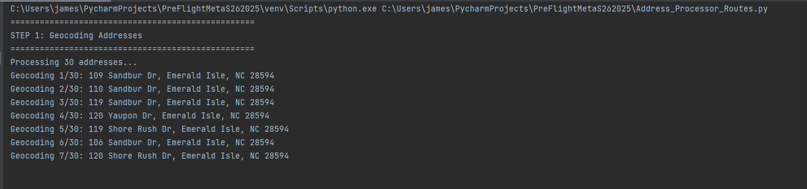
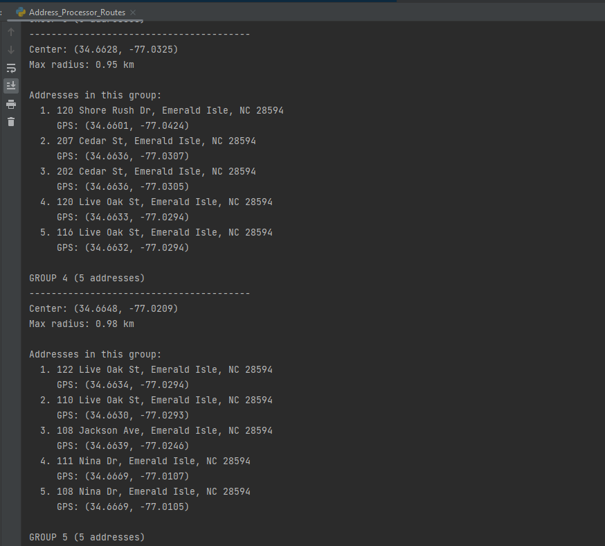
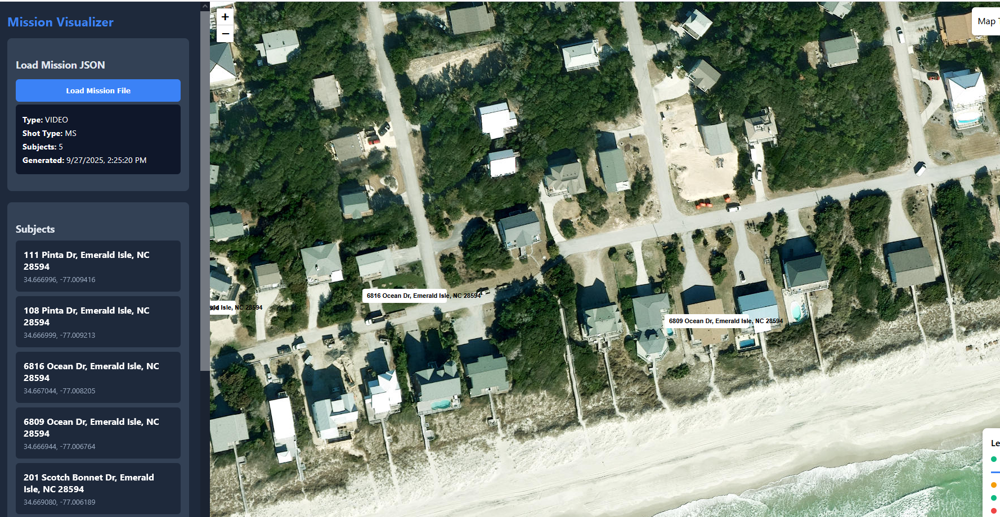
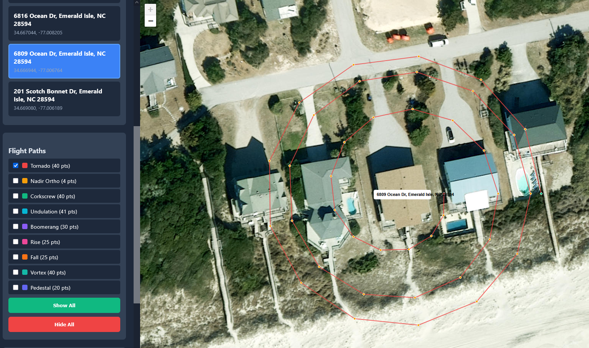
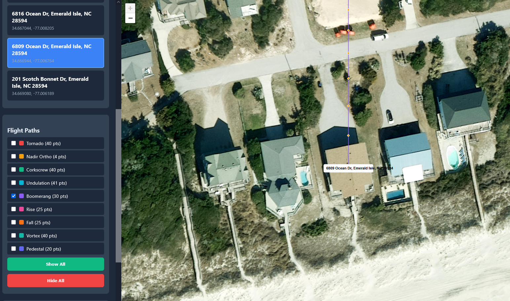

# 🗺️ Drone Mission Planning & Visualization Workflow

This comprehensive toolchain converts addresses into GPS coordinates, groups nearby properties, generates automated drone flight plans, and visualizes them on an interactive map. The workflow progresses from address list to geocoded locations, then to grouped mission files, and finally to visual flight path inspection.

---

## 📋 Step-by-Step Workflow

### 1. Geocode Addresses with `Address_Processor_Routes.py`

Run the address processor to convert street addresses into GPS coordinates. The script reads addresses from `addresses.txt` (or uses test data) and geocodes each location using OpenStreetMap's Nominatim service.

```bash
python Address_Processor_Routes.py
```



The script processes each address, displays geocoding progress, and saves results to `raw_repo.json` with latitude/longitude coordinates for each location.

---

### 2. Review Grouped Address Clusters

The geocoder automatically groups addresses by proximity (max 5 per group) using Haversine distance calculations. Each group represents a cluster of properties that can be covered in a single drone mission.



Groups are displayed with their center coordinates, maximum radius, and individual address details. Group summary files (`group_1.json`, `group_2.json`, etc.) are saved for use in the next step.

---

### 3. Generate Mission Files with `drone_flight_generator.py`

Run the flight generator to create complete mission plans from grouped address data. The tool calculates property envelopes based on zoning regulations and generates video or photo flight patterns for each subject.

```bash
python drone_flight_generator.py
```

The script generates two mission output files:

- **`video_mission_output.json`** – Cinematic video flight patterns (tornado, corkscrew, undulation, boomerang, rise, fall, etc.)
- **`photo_mission_output.json`** – Photo-specific patterns (strafe left/right, pan in/out, orbit, staircase, overhead, etc.)

Each subject receives a full set of flight types with calculated waypoints, altitude ranges, and heading information.

---

### 4. Load Mission JSON into Visualization Tool

Open `Mission_Visualization.html` in your browser and load the generated JSON mission file using the **"Load Mission File"** button. The tool parses the mission data and displays all subjects on an interactive map.



The sidebar shows mission metadata (type, shot type, subject count) and lists all addresses grouped by proximity. Click any subject to view its flight options.

---

### 5. Select & Visualize Flight Paths

Choose individual flight types from the sidebar to display their waypoint paths on the map. Each flight type appears in a distinct color, with waypoints shown as dots (green for start, yellow for intermediate, red for end).



Toggle checkboxes to show/hide specific flight patterns. The map supports satellite, streets, and terrain views for better situational awareness.

---

### 6. Inspect Multiple Flight Types

The tool allows you to overlay multiple flight patterns simultaneously, making it easy to compare different approaches for the same subject. The sidebar displays real-time statistics including active flights, total waypoints, and estimated flight time.



All flight paths are drawn with waypoint markers, and the statistics panel updates dynamically as you toggle patterns on and off. Use **"Show All"** and **"Hide All"** buttons to quickly manage visibility.

---

## 📊 Key Outputs

| Step | Output File | Description |
|------|-------------|-------------|
| 1 | `raw_repo.json` | Geocoded addresses with GPS coordinates |
| 2 | `group_*.json` | Clustered address groups (max 5 per group) |
| 2 | `groups_summary.json` | Overview of all groups with statistics |
| 3 | `video_mission_output.json` | Complete video flight plans for all subjects |
| 3 | `photo_mission_output.json` | Complete photo flight plans for all subjects |
| 4–6 | `Mission_Visualization.html` | Interactive map for flight path inspection |

---

## 🎯 Supported Flight Patterns

| Video Patterns | Photo Patterns |
|----------------|----------------|
| Tornado (Vortex) | Strafe Left (Low/Medium/High) |
| Nadir Ortho (Grid) | Strafe Right (Low/Medium/High) |
| Corkscrew (Helix) | Pan In (Low/Medium/High) |
| Undulation (Sine Wave) | Pan Out (Low/Medium/High) |
| Boomerang (Parabola) | Staircase Curve |
| Rise | Orbit |
| Fall | Overhead (Nadir) |
| Pedestal | XLS (Extreme Long Shot) |
